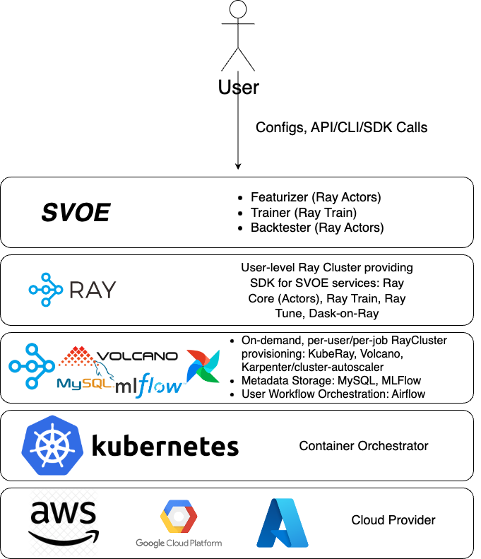

## *What is SVOE?*

**SVOE** is a low-code declarative framework providing scalable and highly configurable pipelines for 
time-series data research, streaming and batch feature engineering, predictive model training, 
real-time inference and backtesting. Built on top of **[Ray](https://github.com/ray-project/ray)**, the framework allows to build and scale your custom pipelines 
from multi-core laptop to a cluster of 1000s of nodes.

**SVOE** was originally built to accommodate a typical financial data research workflow (i.e. for Quant Researchers) with 
specific data models in mind (trades, quotes, order book updates, etc., hence some examples are provided in this domain), 
however the framework itself is domain-agnostic and it's components can easily be generalised and used in other fields 
which rely on real-time time-series based data processing and simulation(fraud/anomaly detection, sales forecasting etc.)



## *How does it work?*

SVOE consists of three main components, each providing a set of tools for a typical Quant/ML engineer workflow

- ***[Featurizer](https://anovv.github.io/svoe/featurizer-overview/)*** helps defining, calculating, storing and analyzing
real-time/offline time-series based features
- ***[Trainer](https://anovv.github.io/svoe/trainer-overview/)*** allows training predictive models in distributed setting using popular
ML libraries (XGBoost, PyTorch)
- ***[Backtester](https://anovv.github.io/svoe/backtester-overview/)*** is used to validate and test predictive models along with
user defined logic (i.e. trading strategies if used in financial domain)

You can read more in [docs](https://anovv.github.io/svoe/)

## *Why use SVOE?*

- ***Easy to use standardized and flexible data and computation models*** - seamlessly switch between real-time and
historical data for feature engineering, ML training and backtesting
- ***Low code, modularity and configurability*** - define reusable components such as 
```FeatureDefinition```, ```DataSourceDefinition```, ```FeaturizerConfig```, ```TrainerConfig```, ```BacktesterConfig``` etc. 
to easily run your experiments
- ***Ray integration*** - SVOE runs wherever **[Ray](https://github.com/ray-project/ray)** runs (everywhere!)
- ***MLFlow integration*** - store, retrieve and analyze your ML models with **[MLFlow](https://github.com/mlflow/mlflow)** API
- ***Cloud / Kubernetes ready*** - use **KubeRay** or native **Ray on AWS** to scale out your workloads in a cloud
- ***Easily integrates with orchestrators (Airflow, Luigi, Prefect)*** - SVOE provides basic **[Airflow Operators](https://airflow.apache.org/docs/apache-airflow/stable/core-concepts/operators.html)**
for each component to easily orchestrate your workflows
- ***Designed for high volume low granularity data*** - when used in financial domain, unlike existing financial ML frameworks which use only OHLCV
as a base data model, SVOE's **[Featurizer](https://anovv.github.io/svoe/featurizer-overview/)** provides flexible tools to use and customize any data source (ticks, trades, book updates, etc.)
and build streaming and historical features
- ***Minimized number of external dependencies*** - SVOE is built using **[Ray Core](https://docs.ray.io/en/latest/ray-core/walkthrough.html)** primitives and has no heavyweight external dependencies
(stream processor, distributed computing engines, storages, etc.) which allows for easy deployment, maintenance and minimizes
costly data transfers. The only dependency is an SQL database of user's choice. And it's all Python!


## *Installation*

Install from PyPi. Be aware that Svoe requires Python 3.10+.

```
pip install svoe
```

For local environment launch standalone setup on your laptop. This will start local Ray cluster, create and populate 
SQLite database, spin up MLFlow tracking server and load sample data from remote store (S3). Make sure you have
all necessary dependencies present
```
svoe standalone
```

For distributed setting, please refer to [Running on remote clusters](TODO)


## *Quick Start*

For this example, we will consider a scenario which often occurs in financial markets simulation, however please note that the framework is not limited to financial data and can be used with whatever scenario user provides.
As an example, here is a simple 3 step tutorial to build a simple **[mid-price](https://en.wikipedia.org/wiki/Mid_price)** prediction model based on past price and volatility. 

- Run ***[Featurizer](https://anovv.github.io/svoe/featurizer-overview/)*** to construct mid-price and volatility features from partial order book updates, 5 second lookahead label as prediction target, using 1 second granularity data 
  - Define `featurizer-config.yaml`
    ```
    start_date: '2023-02-01 10:00:00'
    end_date: '2023-02-01 11:00:00'
    label_feature_index: 0
    label_lookahead: '5s'
    features_to_store: [0, 1]
    feature_configs:
      - feature_definition: price.mid_price_fd.MidPriceFD
        name: mid_price
        params:
          data_source: &id001
            - exchange: BINANCE
              instrument_type: spot
              symbol: BTC-USDT
          feature:
            sampling: 1s
      - feature_definition: volatility.volatility_stddev_fd.VolatilityStddevFD
        params
          data_source: *id001
          feature:
            sampling: 1s
    ```
    See [MidPriceFD](https://github.com/anovv/svoe/blob/main/featurizer/features/definitions/price/mid_price_fd/mid_price_fd.py) and [VolatilityStddevFD](https://github.com/anovv/svoe/blob/main/featurizer/features/definitions/volatility/volatility_stddev_fd/volatility_stddev_fd.py) for implementation details
  - Run Featurizer
    - CLI: `svoe featurizer run <path_to_config> --ray-address <addr> --parallelism <num-workers>`
    - Python API: `Featurizer.run(path=<path_to_config>, ray_address=<addr>, parallelism=<num_workers>)`
  - Once calculation is finished, load sampled ```FeatureLabelSet``` dataframe to your local client
    - CLI: `svoe featurizer get-data --every-n <every_nth_row>`
    - Python API: `Featurizer.get_materialized_data(pick_every_nth_row=<every_nth_row>)`
    ```
          timestamp  receipt_timestamp  label_mid_price-mid_price  mid_price-mid_price  feature_VolatilityStddevFD_62271b09-volatility
    0     1.675234e+09       1.675234e+09                  23084.800            23084.435                                        0.000547
    1     1.675234e+09       1.675234e+09                  23083.760            23084.355                                        0.040003
    2     1.675234e+09       1.675234e+09                  23083.505            23084.635                                        0.117757
    3     1.675234e+09       1.675234e+09                  23084.610            23085.020                                        0.257091
    4     1.675234e+09       1.675234e+09                  23084.725            23084.800                                        0.242034
    ...            ...                ...                        ...                  ...                                             ...
    ```
  - We can also visualize the results
    - CLI: `svoe featurizer plot --every-n <every_nth_row>`
- Once we have our ```FeatureLabelSet``` calculated and loaded in cluster memory, let's use ***[Trainer](https://anovv.github.io/svoe/trainer-overview/)*** to train XGBoost model to predict mid-price 5 seconds ahead, validate the model, tune hyperparams and pick best model
  - Define config
    ```
    xgboost:
      params:
        tree_method: 'approx'
        objective: 'reg:linear'
        eval_metric: [ 'logloss', 'error' ]
      num_boost_rounds: 10
      train_valid_test_split: [0.5, 0.3]
    num_workers: 3
    tuner_config:
      param_space:
        params:
          max_depth:
            randint:
              lower: 2
              upper: 8
          min_child_weight:
            randint:
              lower: 1
              upper: 10
      num_samples: 8
      metric: 'train-logloss'
      mode: 'min'
    max_concurrent_trials: 3
    ```
  - Run Trainer
    - CLI: `svoe trainer run --config-path <config-path> --ray-address <addr>`
    - Python API: 
      ```
      config = TrainerConfig.load_config(config_path)
      trainer_manager = TrainerManager(config=config, ray_address=ray_address)
      trainer_manager.run(trainer_run_id='sample-run-id', tags={})
      ```
  - Visualize predictions
    - CLI: `svoe trainer predictions --model-uri <model-uri>`
  - Select best model
    - CLI: `svoe trainer best-model --metric-name valid-logloss --mode min`
    - Python API:
      ```
      mlflow_client = SvoeMLFlowClient()
      best-model-uri = mlflow_client.get_best_checkpoint_uri(metric_name=metric_name, experiment_name=experiment_name, mode=mode)
      ```
-  In this example, we use ***[Backtester](https://anovv.github.io/svoe/backtester-overview/)*** in the context of financial markets, hence our user-defined logic is based on a notion of trading strategy. This can be extended to any other scenario which user wants to emulate. Once we have our best model, we can plug it in our ```BaseStrategy``` derived class and run backtester to simulate our scenario
  
   - Define config
     ```
     featurizer_config_path: featurizer-config.yaml
     inference_config:
       model_uri: <your-best-model-uri>
       predictor_class_name: 'XGBoostPredictor'
       num_replicas: <number-of-predictor-replicas>
     simulation_class_name: 'backtester.strategy.ml_strategy.MLStrategy'
     simulation_params:
       buy_delta: 0
       sell_delta: 0
     user_defined_params:
       portfolio_config: <portfolio_config>
       tradable_instruments_params:
         - exchange: 'BINANCE'
           instrument_type: 'spot'
           symbol: 'BTC-USDT'
     ```
     See [MLStrategy](https://github.com/anovv/svoe/blob/main/backtester/strategy/ml_strategy.py) for example implementation
    - Run Backtester
      - CLI: `svoe backtester run --config-path <config-path> --ray-address <addr> --num-workers <num-workers>`
      - Python API:
        ```
        config = BacktesterConfig.load_config(config_path)
        backtester = Backtester.from_config(config)
        backtester.run_remotely(ray_address=ray_address, num_workers=num_workers)
        ```
      This will run a distributed event-driven backtest using features and models defined earlier
    - Get stats with `backtester.get_stats()`

## *Documentation*

We try to maintain as fresh and detailed [docs](https://anovv.github.io/svoe/) as possible. Please leave your feedback
if you have any questions.

## *Contributions*

SVOE is an open-source first project and we would love to get feedback and contributions from the community! 
The project is in a very early stage and is still a work in progress, so any help would be greatly appreciated! Please feel
free to open GitHub issues with questions/bugs or PRs with contributions!
