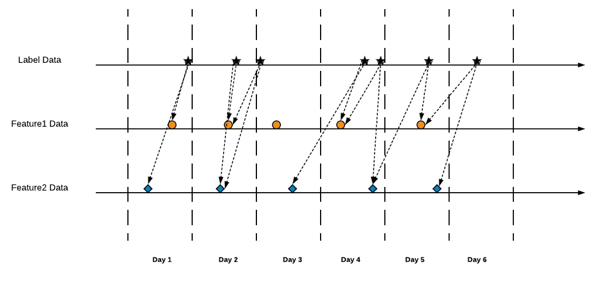

# Featurizer Task Graph

## Overview

The core of Featurizer's offline feature calculation is in building and executing Task Graph.

Task Graph is a graph made of load, preprocess and user-defined feature specific calculation logic tasks
automatically built by the framework. See more in ```featurizer.task_graph.builder.py```

## How Building FeatureSet Graph Works

As mentioned in **Features and Feature Definitions** section, each ```Feature``` is a tree-like structure with
```DataSource``` leafs, dependent features as nodes and target feature as a root.
When user defines all necessary features in a ```FeaturizerConfig```, the framework builds all the
feature trees and their interdependencies and then maps corresponding feature calculation tasks (which are
defined by ```FeatureDefinition:stream``` method) and data source load tasks into a graph. The tasks are interconnected
by passing dataframes as inputs and returns, which are stored in Ray's distributed memory

When user specifies time range, Featurizer fetches metadata about all dependent data source blocks and builds final graph
by applying tree-like features to each block (and possible others, which are defined by user in 
```FeatureDefinition:group_dep_ranges```)


## Labels and FeatureLabelSet Graph

When building data sets for supervised learning, users need to defined **labels** to be used as target values.
Users can pick *any feature* in a feature set as a label by setting specific config option.
Since we operate on time series data and solve time-based prediction problem, this feature/label will be *shifted ahead* 
relatively to all other features by a time period specified by user, this way we will produce FeatureLabelSet ready
to be used as an input for predictive ML models training/validation/testing steps.

Config options:

- name or index of a feature to mark as a label
```
label_feature: 0
```

- how far ahead we want to shift labeled timeseries to be used as predictor targets
```
label_lookahead: '10s'
```

## Point-in-time Joins

Since features may have different time granularity and/or irregular frequencies, in order to produce unified 
dataframe with multiple features we need to perform a join operation. The framework automatically builds join tasks
and takes care of updating resulting graph to produce unified dataframe (see picture).



## Execution

After Task Graph is build, the framework submits it to Ray cluster for execution. Sub-graphs are submitted in batches
defined by ```parallelism``` parameter:

```
Featurizer.run(config=<config>, ray_address=<ray_address>, parallelism=<parallelism>)
```

Ray automatically takes care of executing them amongst workers. In order to effectively 
see speed-up from horizontal scaling users need to make sure that the cluster has more cores than ```parallelism```.

Oncec execution is finished, the resulting dataframes are stored in cluster's distributed memory and can be accessed via
```Featurizer.get_dataset()```

More in ```featurizer.task_graph.executor.py```
