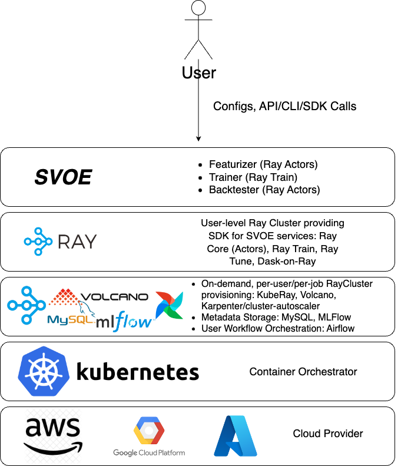

## *Overview*

**[SVOE](https://github.com/anovv/svoe)** is a low-code framework providing scalable and highly configurable pipelines for time-series data research, 
streaming and batch feature engineering, predictive model training, real-time inference and backtesting. 
Built on top of **[Ray](https://github.com/ray-project/ray)**, the framework allows to build and scale your 
custom pipelines from multi-core laptop to a cluster of 1000s of nodes.

**SVOE** was originally built to accommodate a typical financial data research workflow (i.e. for Quant Researchers) with 
specific data models in mind (trades, quotes, order book updates, etc., hence some examples are provided in this domain), 
however the framework itself is domain-agnostic and it's components can easily be generalised and used in other fields 
which rely on real-time time-series based data processing and simulation (anomaly detection, sales forecasting etc.)



## *How does it work?*

SVOE consists of three main components, each providing a set of tools for a typical Quant/ML engineer workflow

- ***[Featurizer](https://anovv.github.io/svoe/featurizer-overview/)*** helps defining, calculating, storing and analyzing
real-time/offline time-series based features
- ***[Trainer](https://anovv.github.io/svoe/trainer-overview/)*** allows training predictive models in distributed setting using popular
ML libraries (XGBoost, PyTorch)
- ***[Backtester](https://anovv.github.io/svoe/backtester-overview/)*** is used to validate and test predictive models along with
user defined logic (i.e. trading strategies if used in financial domain)

You can read more in [docs](https://anovv.github.io/svoe/)

## *Why use SVOE?*


- ***Easy to use standardized and flexible data and computation models for unified batch and stream computations*** - seamlessly switch between real-time and
historical data for feature engineering, ML training and backtesting
- ***Low code, modularity and configurability*** - define reusable components such as 
```FeatureDefinition```, ```DataSourceDefinition```, ```FeaturizerConfig```, ```TrainerConfig```, ```BacktesterConfig``` etc. 
to easily run your experiments
- ***Avoid train-predict inconsistency*** - **[Featurizer](https://anovv.github.io/svoe/featurizer-overview/)** uses same feature definition for real-time inference and batch training
- ***No need for external data infra/DWH*** - **[Featurizer Storage](https://anovv.github.io/svoe/featurizer-storage/)** allows to store and catalog computed features in any block storage while keeping index
in any SQL backend, provides Data Exploration API
- ***Ray integration*** - SVOE runs wherever **[Ray](https://github.com/ray-project/ray)** runs (everywhere!)
- ***MLFlow integration*** - store, retrieve and analyze your ML models with **[MLFlow](https://github.com/mlflow/mlflow)** API
- ***Cloud / Kubernetes ready*** - use **KubeRay** or native **Ray on AWS** to scale out your workloads in a cloud
- ***Easily integrates with orchestrators (Airflow, Luigi, Prefect)*** - SVOE provides basic **[Airflow Operators](https://airflow.apache.org/docs/apache-airflow/stable/core-concepts/operators.html)**
for each component to easily orchestrate your workflows
- ***Real-time inference without MLOps burden*** - no need to maintain model containerization pipelines, FastAPI services and model registries. Deploy with simple Python API or yaml using **[InferenceLoop](https://anovv.github.io/svoe/featurizer-inference-loop/)**
- ***Designed for high volume low granularity data*** - as an example, when used in financial domain, unlike existing financial ML frameworks which use only OHLCV
as a base data model, SVOE's **[Featurizer](https://anovv.github.io/svoe/featurizer-overview/)** provides flexible tools to use and customize any data source (ticks, trades, book updates, etc.)
and build streaming and historical features
- ***Minimized number of external dependencies*** - SVOE is built using **[Ray Core](https://docs.ray.io/en/latest/ray-core/walkthrough.html)** primitives and has no heavyweight external dependencies
(stream processor, distributed computing engines, storages, etc.) which allows for easy deployment, maintenance and minimizes
costly data transfers. The only dependency is an SQL database of user's choice. And it's all Python!


Please refer to **[Installation](https://anovv.github.io/svoe/installation/)** and **[Quick Start](https://anovv.github.io/svoe/quick-start/)** for more details

